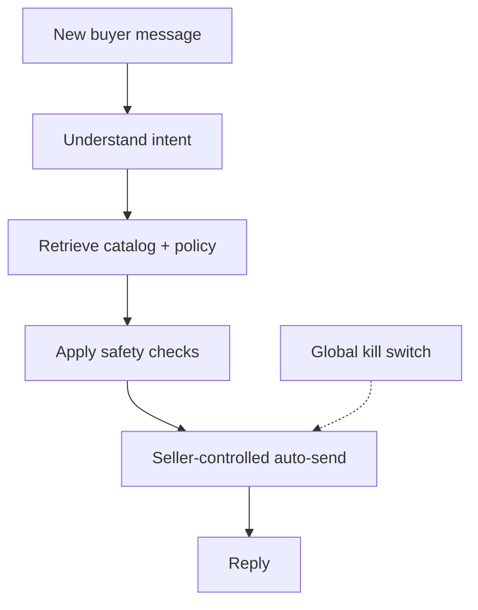

<h1 align="center">Bảo / baodev</h1>

  <strong>Backend &amp; AI systems engineer</strong> 
  I build reliable automation for real operations — with safety, observability,
  and the unhappy path designed in.

  <a href="https://baodev.me/"><strong>Portfolio</strong></a>
  ·
  <a href="mailto:quocbao201104@gmail.com"><strong>Email</strong></a>
  ·
  <a href="#omnipilot"><strong>Current focus: OmniPilot</strong></a>

---

## OmniPilot

> **A seller-controlled AI sales agent for Shopee.**
> It reads new buyer messages, identifies intent, grounds answers in shop
> catalog and policies, and can reply on the seller's behalf.

OmniPilot is my main project: a practical AI workflow that can operate
continuously without removing the seller's authority over what gets sent.

- **Grounded** — answers come from the shop's catalog and policies, not an
  unconstrained model response.
- **Guarded** — risky buyers and off-platform requests are filtered before an
  automated reply can be sent.
- **Seller-controlled** — auto-send remains configurable, with a global
  kill switch over automated replies.
- **Resilient** — the workflow is designed to run unattended and recover from
  interruptions.

`TypeScript` · `Chrome Extension` · `Node.js` · `LLM` · `RAG`

### Product loop

> [!NOTE]
> OmniPilot is a private project. This overview intentionally focuses on
> product behavior and the engineering boundaries that make the automation
> safe to operate.

---

## Engineering focus

I work where backend infrastructure and AI workflows meet:

- **Reliable backends** — explicit routing, validation, failover, queues, and
  observability.
- **Controlled AI workflows** — grounded retrieval, quality checks, guardrails,
  and clear decision paths.
- **Security by default** — authentication, access control, and data integrity
  belong in the foundation.

**Core:** `TypeScript` · `Node.js` · `Python`

**Data:** `PostgreSQL` · `MySQL` · `Redis` · `Queue systems`

**AI systems:** `RAG` · `LLM pipelines` · `Agent orchestration`

**Infrastructure:** `Cloudflare R2` · `Cloudinary` · `Vercel`

---

## Public code

- **[Audio Ingest](https://github.com/quocbao201104/Audio-Ingest)** —
  a YouTube audio-processing pipeline with queue-based ingestion.
- **[Crawl Novel](https://github.com/quocbao201104/Crawl-Novel)** —
  content crawler for the TruyenVietHay platform.
- **[Portfolio source](https://github.com/quocbao201104/quocbao201104.github.io)** —
  source for my personal website, [baodev.me](https://baodev.me/).

<strong>More selected work</strong>

- **MarketGap** — product-opportunity intelligence that compares demand on
  1688 with competition on Shopee Vietnam. `Python` · `Next.js` · `PostgreSQL`
  · Private
- **Arbitext** — a document-translation workflow with
  staged analysis, drafting, QA, repair, provider failover, and telemetry.
  `Node.js` · `TypeScript` · `Redis` · Private
- **[TruyenVietHay](https://truyenviethay.id.vn/)** — a Vietnamese content and
  audio platform with CDN-backed media delivery and queue-based ingestion.
  `Node.js` · `TypeScript` · `MySQL` · `Redis` · Private

---

  Open to backend and AI systems work where reliability and safe automation matter. 
  <a href="https://baodev.me/">baodev.me</a>
  ·
  <a href="mailto:quocbao201104@gmail.com">quocbao201104@gmail.com</a>

